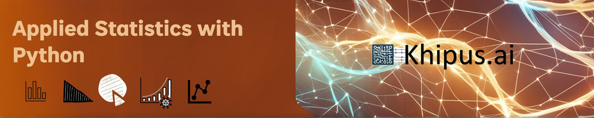

# **Khipus.ai**

# © Copyright Notice 2025, Khipus.ai - All Rights Reserved.

# Applied Statistics with Python

The Applied Statistics with Python module provides a comprehensive foundation in statistical analysis, focusing on both descriptive and inferential statistical techniques for data-driven decision-making. Learners will explore core concepts such as measures of central tendency (mean, median, mode), variability (variance, standard deviation), and data visualization using Python libraries like Matplotlib. The module introduces the importance of summarizing datasets effectively through bar charts, histograms, scatter plots, and boxplots, providing insights into data distribution and relationships. Additionally, it covers the theoretical foundations of probability, including random variables, probability distributions, and Bayes' Theorem, equipping learners with essential tools for modeling uncertainty and making data-based predictions.

Moving beyond foundational statistics, this module emphasizes the application of statistical models in Python for hypothesis testing and predictive modeling. Key inferential techniques such as the Central Limit Theorem, hypothesis testing (t-tests, z-tests), and p-value interpretation are introduced for drawing conclusions from sample data. Learners will also gain proficiency in regression models, including linear and logistic regression, to explore relationships between variables and predict outcomes. Hands-on coding activities using Python’s Pandas, NumPy, and Jupyter Notebooks will reinforce theoretical concepts with practical implementation, empowering participants to apply statistical methods confidently in real-world data science projects.
